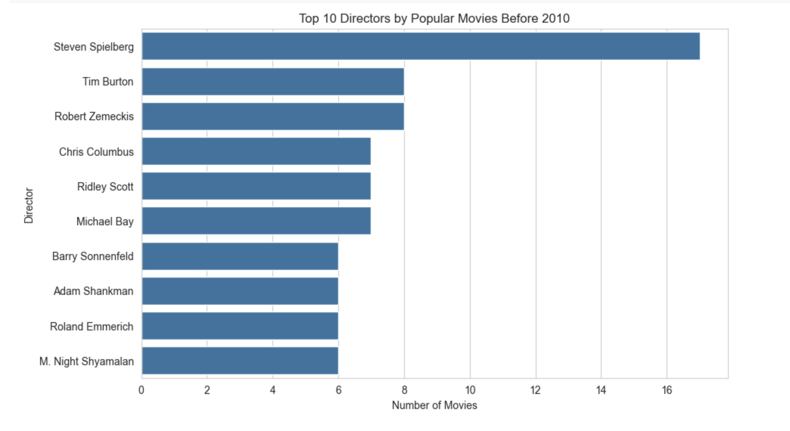
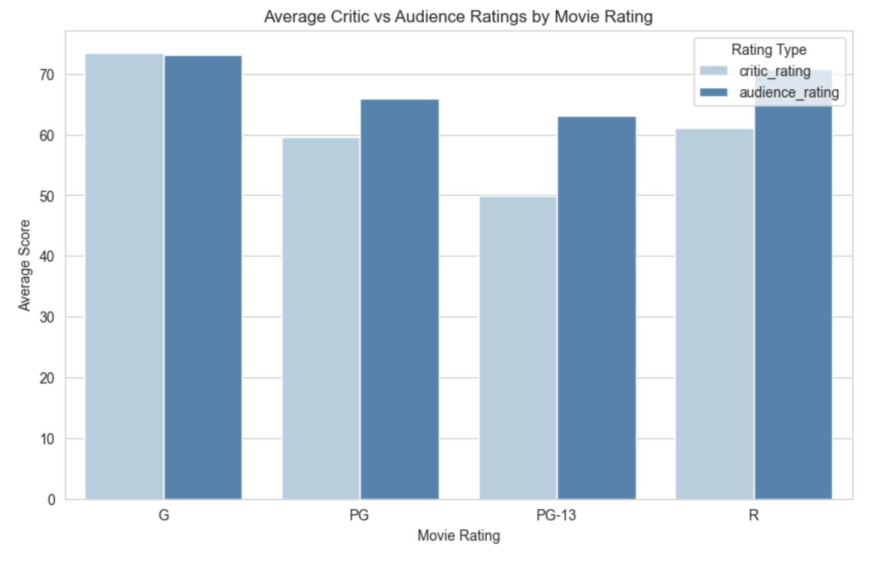
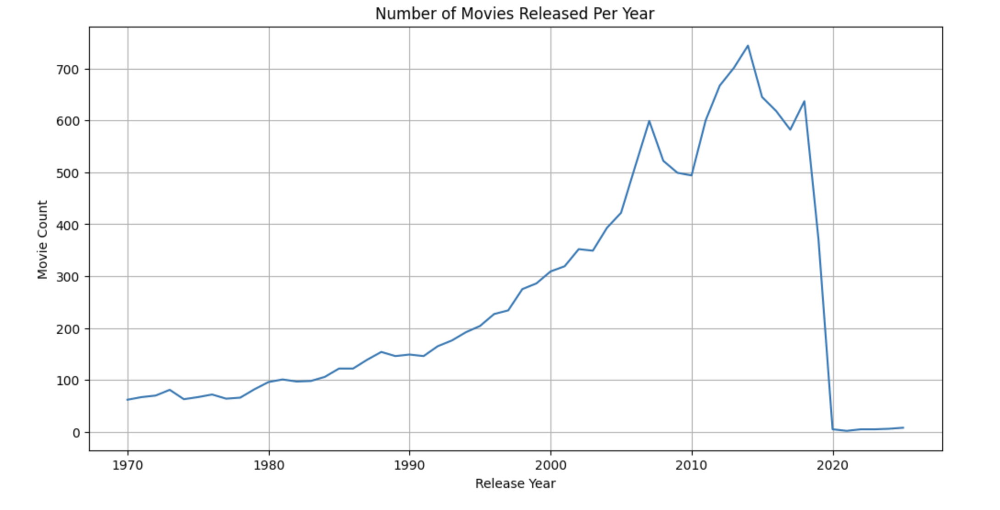

# Movie Critic Rating Prediction
MSDS – Machine Learning & Data Science Project

This project builds a predictive model that estimates a movie’s critic rating using pre-release information such as genre, runtime, and MPAA rating. 
The project includes data extraction from PostgreSQL, data cleaning, exploratory data analysis, feature engineering, and linear regression modeling.


## 0. Project Preview
Below are examples of the visual outputs.

**1. Number of Movies Released Per Year**

The number of movies released each year gradually increases from the 1970s through the 2000s.



**2. Average Critic vs Audience Ratings by Movie Rating**

Most movies are PG-13 and R before 2010, G-rated movies make up a smaller percentage on the other hand.



**3. Top 10 Directors by Popular Movies Before 2010**

The well-established directors consistently produce commercially successful and widely-viewed movies.




## 1. Project Structure

Basic layout:

```arduino
movie-analysis/
│
├── README.md
├── requirements.txt
├── .gitignore
├── .env                # Not included in repo (ignored)
│
├── data/
│   ├── movies_raw.csv
│   └── movies_clean.csv
│
├── notebooks/
│   └── project.ipynb   # Full analysis, EDA, feature engineering, modeling
│
├── src/
│   └── db_connection.py
│
└── reports/
    └── figures/        # visualizations generated in notebook
```


## 2. Data Source
The raw data was obtained from the **Northwestern MLDS PostgreSQL server**, inside the database:

```cpp
everything2025.public.movies
```

Data was extracted using the Python library **psycopg** through a secure `.env` file for database credentials.

## 3. Key Steps in the Project
### 1. Data Cleaning & EDA
* Fixed invalid or missing theatrical release years
* Created visualizations for yearly movie counts
* Identified popular movies using audience review counts
* Explored rating distributions
* Built pair plots and discovered patterns in runtime, genre, and ratings

### 2. Feature Engineering
Created new predictive features, including:
* `kid_friendly` (1 for G/PG, else 0)
* Genre dummy variables
* `genre_count`
* `runtime_ratio` (relative to decade average)
* `decade`

### 3. Modeling
Six linear regression models were trained:
* **Model 1**: runtime only
* **Model 2**: runtime + kid_friendly
* **Model 3**: runtime + kid_friendly + genre dummies
* **Model 4–6**: added engineered features (`genre_count`, `runtime_ratio`, `decade`)

### 4. Model Evaluation
Each model was evaluated using:
* **R²**
* **MAE**
* **RMSE**
  
**Model 3 performed the best**, showing that genre is the strongest predictor of critic ratings.

| Model       | R²         | MAE       | RMSE      |
| ----------- | ---------- | --------- | --------- |
| Model 1     | -0.0238    | 25.07     | 28.71     |
| Model 2     | -0.0256    | 25.11     | 28.74     |
| **Model 3** | **0.1439** | **21.82** | **26.26** |
| Model 4     | 0.1429     | 21.82     | 26.27     |
| Model 5     | 0.1176     | 22.43     | 26.65     |
| Model 6     | 0.0618     | 23.29     | 27.48     |


